# Documentacao Tecnica — Total Fretes (Backend)

> Gerado automaticamente pela skill ProjectDoc AI
> Data: 2026-05-28

---

## 1. Visao Geral do Sistema

**Objetivo do projeto:**
Backend de microsservicos para o ecossistema Total Fretes. Atende o portal web de empresas e o app mobile de motoristas, centralizando autenticacao, cadastro, fretes e propostas, uploads, i18n e documentacao OpenAPI.

**Tipo de sistema:**
API REST em microsservicos com gateway Nginx, bancos por dominio, mensageria RabbitMQ e cache Redis.

**Status percebido:**
Em desenvolvimento ativo (TCC).

---

## 2. Tecnologias Utilizadas

| Categoria                     | Tecnologia / Versao |
| ----------------------------- | ------------------- |
| Linguagem principal           | TypeScript 5.9 |
| Runtime / Plataforma          | Node.js 22 |
| Framework principal           | Express 5 (swagger-service usa Express 4) |
| Banco de dados                | MySQL 8 |
| ORM / Query builder           | Sequelize 6 + mysql2 |
| Validacao                     | Zod 4 |
| Autenticacao                  | JWT (jsonwebtoken) + bcrypt |
| Mensageria                    | RabbitMQ (amqplib) |
| Cache                         | Redis (ioredis) |
| HTTP entre servicos           | axios |
| Containerizacao               | Docker + Docker Compose |
| Testes                        | Jest (scripts presentes) |
| Outras bibliotecas relevantes | Swagger UI, multer, nodemailer |

---

## 3. Arquitetura e Organizacao

**Padrao arquitetural identificado:**
Microsservicos com gateway Nginx e bancos isolados por dominio; comunicacao via HTTP e AMQP.

**Estrutura de diretorios principal:**

```
TCC_ADS_backEnd-TotalFretes/
├── docker-compose.yml
├── nginx/
├── packages/rpc-contracts/
├── docs/
├── authentication-service/
├── user-service/
├── company-service/
├── freight-service/
├── storage-service/
├── email-management-service/
├── mapbox-service/
├── i18n-translation-service/
└── swagger-service/
```

**Descricao das camadas/modulos:**

| Camada / Modulo | Responsabilidade |
| --------------- | ---------------- |
| routes / controllers | Exposicao HTTP e regras de acesso |
| schemas (Zod) | Validacao de entrada |
| models (Sequelize) | Persistencia em MySQL |
| messaging (AMQP) | Eventos assincornos (email) |
| utils / services | Integracoes externas (Mapbox, storage, auth) |

**Fluxo geral de uma requisicao:**
Cliente -> Nginx (gateway) -> microsservico de dominio -> validacao local de JWT -> controller -> schema Zod -> service/model -> MySQL -> resposta.

---

## 4. Regras de Negocio

### 4.1 Regras Explicitas

1. **Recuperacao de senha usa Redis + RabbitMQ**
   - Localizacao: docs/services/authentication-service.md
   - Descricao: codigo de reset e salvo no Redis e o envio do email e feito por fila AMQP.

2. **Roles emitidas no JWT**
   - Localizacao: docs/PROJECT.md
   - Descricao: perfis esperados no token sao USER, COMPANY e ADMIN.

3. **Owner check por subject_id (empresa)**
   - Localizacao: docs/services/company-service.md
   - Descricao: subject_id do JWT deve corresponder ao company.id nas operacoes do owner.

4. **Owner check por subject_id (motorista)**
   - Localizacao: docs/services/user-service.md
   - Descricao: subject_id do JWT deve corresponder ao user.id nas operacoes do owner.

5. **Fluxo de propostas de frete**
   - Localizacao: docs/services/freight-service.md
   - Descricao: empresa aceita/rejeita proposta; motorista confirma/declina.

6. **Upload de imagens com campo image**
   - Localizacao: docs/services/storage-service.md
   - Descricao: upload multipart deve usar o campo image e seguir validacao antes de persistir.

### 4.2 Regras Inferidas

1. **Isolamento por dominio**
   - Evidencia: cada servico principal tem seu proprio MySQL no compose.
   - Descricao: dados de cada dominio sao isolados por banco e por servico.

2. **Autenticacao centralizada**
   - Evidencia: login e contas no authentication-service e uso de subject_id em user/company.
   - Descricao: credenciais ficam fora dos servicos de dominio; estes validam JWT localmente.

3. **Mensagens de erro internacionalizadas**
   - Evidencia: i18n-translation-service serve JSON por servico e locale.
   - Descricao: respostas de erro tendem a usar chaves i18n padronizadas.

---

## 5. Componentes Principais

| Componente | Tipo | Responsabilidade |
| --------- | ---- | ---------------- |
| authentication-service | Service | Login, JWT, contas, reset de senha |
| user-service | Service | Dados do motorista, CNH, veiculos |
| company-service | Service | Dados da empresa, enderecos, imagem |
| freight-service | Service | Fretes, propostas e catalogos |
| storage-service | Service | Upload e metadados de arquivos |
| email-management-service | Worker/Service | Consumo de fila e envio de email |
| mapbox-service | Service | Proxy para API Mapbox |
| i18n-translation-service | Service | JSON i18n e endpoint interno |
| swagger-service | Service | Agregacao de OpenAPI e Swagger UI |
| nginx | Gateway | Roteamento unico com prefixo /api |
| rabbitmq | Infra | Mensageria para emails |
| redis | Infra | Cache temporario de reset de senha |
| @total-fretes/rpc-contracts | Package | Contratos Zod e topologia AMQP |

---

## 6. Fluxos Principais

### Fluxo: Login e uso de JWT

1. Cliente chama login no authentication-service via gateway.
2. Servico autentica e emite JWT com role e subject_id.
3. Demais servicos validam JWT localmente via JWT_SECRET.

### Fluxo: Recuperacao de senha

1. Cliente chama forgot-password.
2. Servico gera codigo, salva no Redis e publica evento em RabbitMQ.
3. email-management-service consome a fila e envia email SMTP.
4. Cliente valida codigo e redefine senha.

### Fluxo: Publicacao de frete e proposta

1. Empresa cria frete no freight-service.
2. Motorista cria proposta para o frete.
3. Empresa aceita/rejeita; motorista confirma/declina.

---

## 7. Boas Praticas Observadas

- Validacao de entrada com Zod em schemas por servico.
- Autenticacao centralizada com validacao local via JWT_SECRET.
- Gateway Nginx unifica prefixos e expande /api.
- Swagger agregado por servico via swagger-service.

---

## 8. Pontos de Atencao

| Severidade | Descricao | Localizacao |
| ---------- | --------- | ----------- |
| Alta | Segredo JWT compartilhado entre servicos exige gestao segura e rotacao | docs/PROJECT.md |
| Media | Swagger UI exposta no gateway sem controle de acesso | docs/services/swagger-service.md |
| Media | Variaveis de ambiente distribuidas por servico exigem disciplina operacional | docs/PROJECT.md |
| Baixa | Cobertura de testes nao esta documentada para a maioria dos servicos | docs/PROJECT.md |

---

## 9. Lacunas de Documentacao

- Nao ha ERD ou diagramas de modelo de dados por servico.
- Nao existe estrategia de testes formalizada (unitario, integracao, e2e).
- Falta padrao documentado de payload AMQP e erros compartilhados.

---

## 10. Diagramas C4 (Mermaid)

### Nivel 1 — Contexto

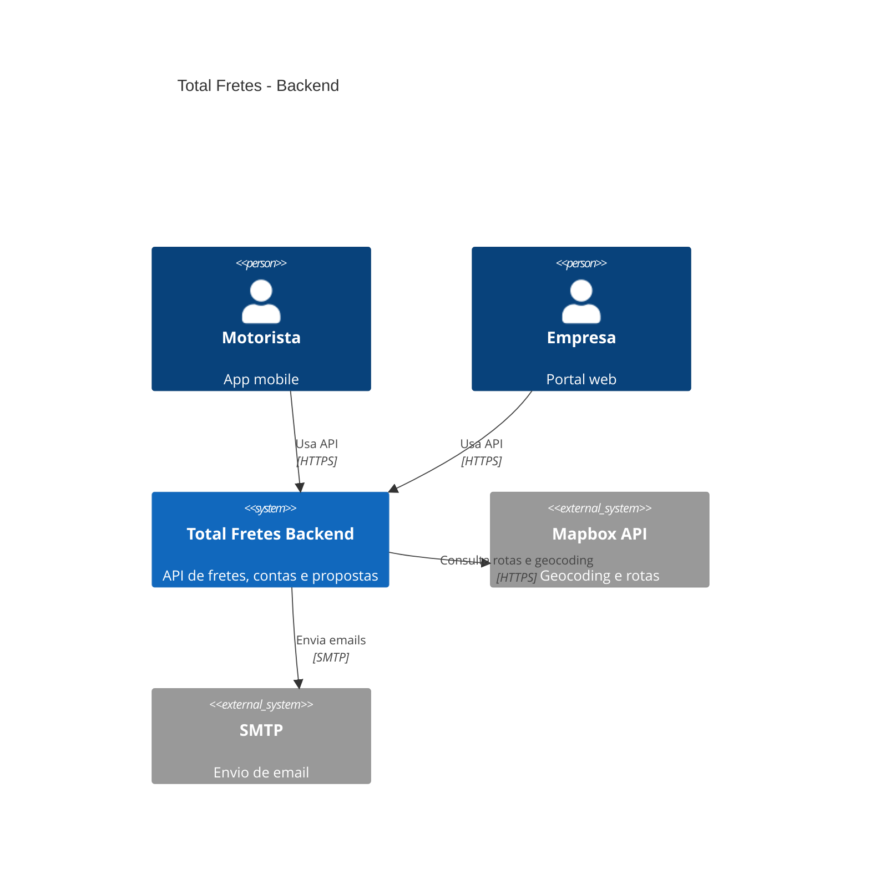

### Nivel 2 — Containers

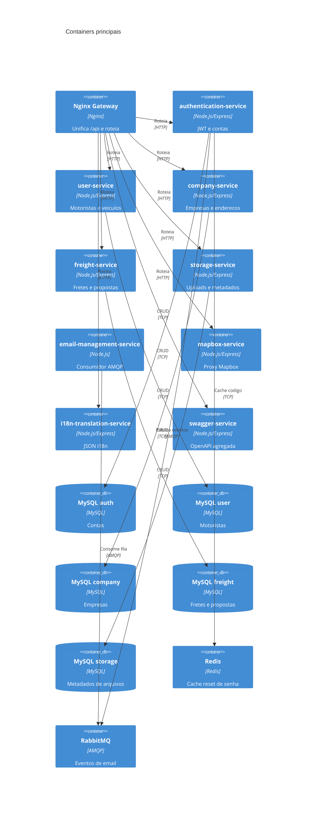

### Nivel 3 — Componentes (authentication-service)

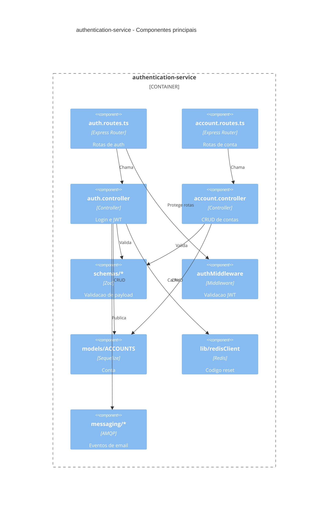

### Nivel 3 — Componentes (freight-service)

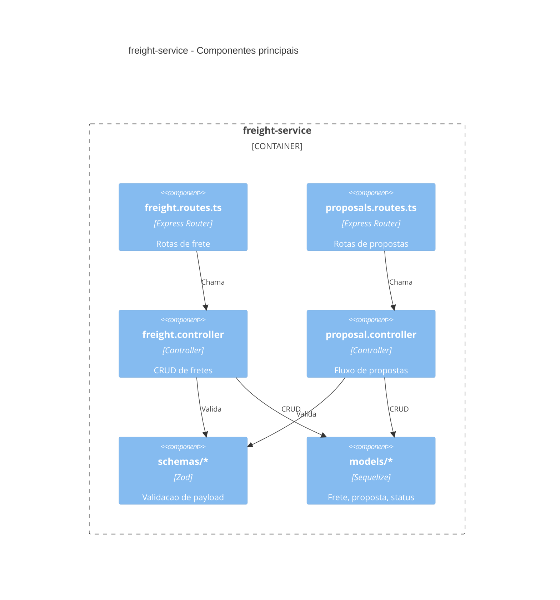

### Nivel 3 — Componentes (user-service)

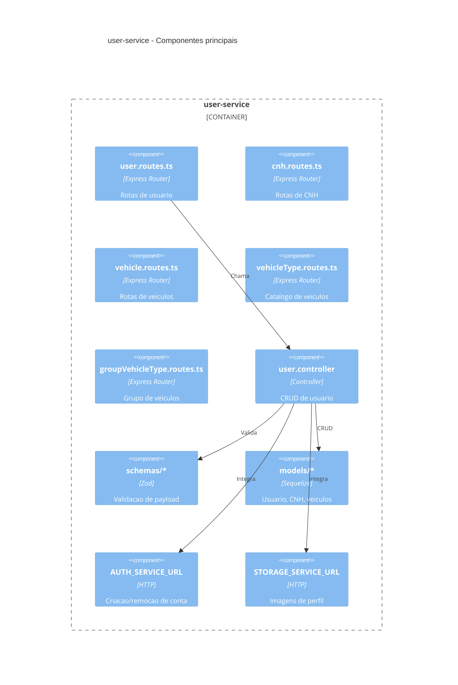

### Nivel 3 — Componentes (company-service)

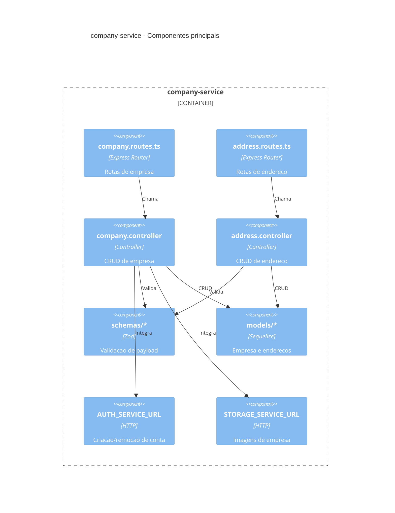

### Nivel 3 — Componentes (storage-service)

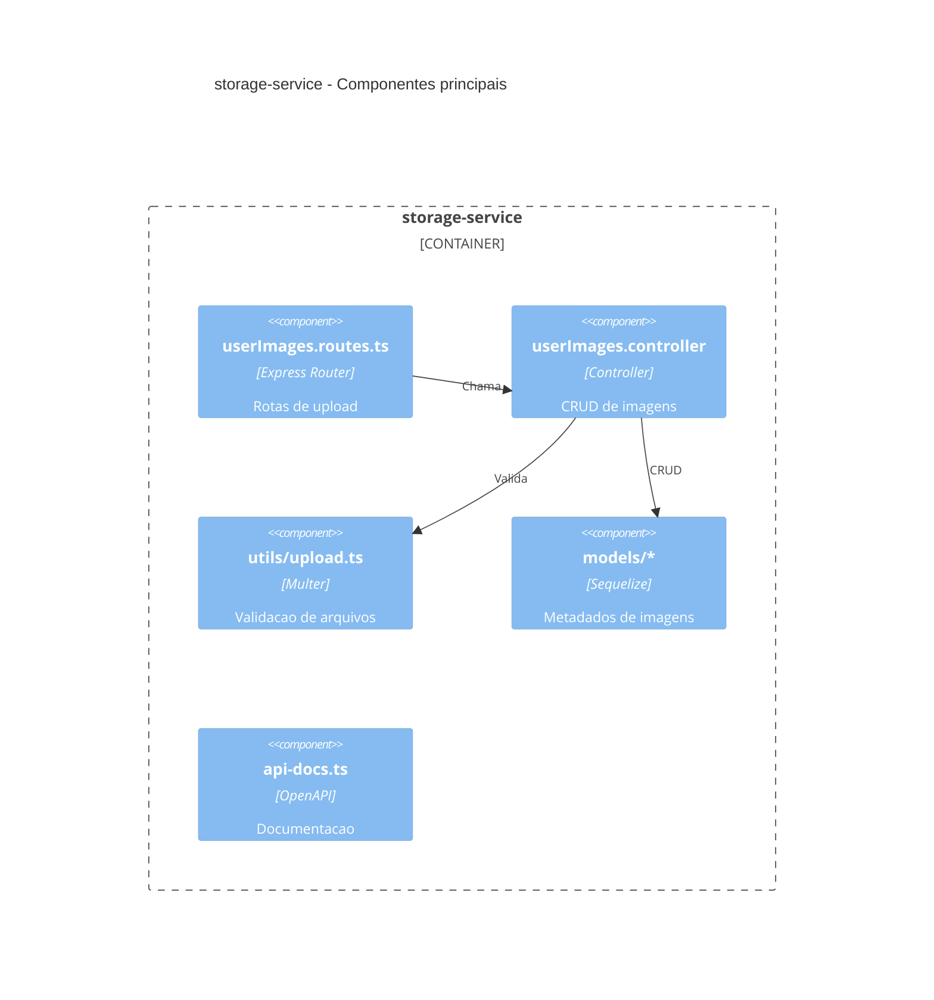

### Nivel 3 — Componentes (email-management-service)

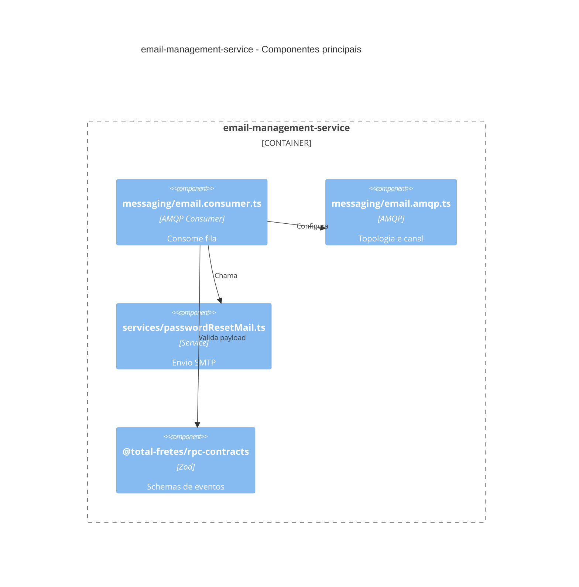

### Nivel 3 — Componentes (mapbox-service)

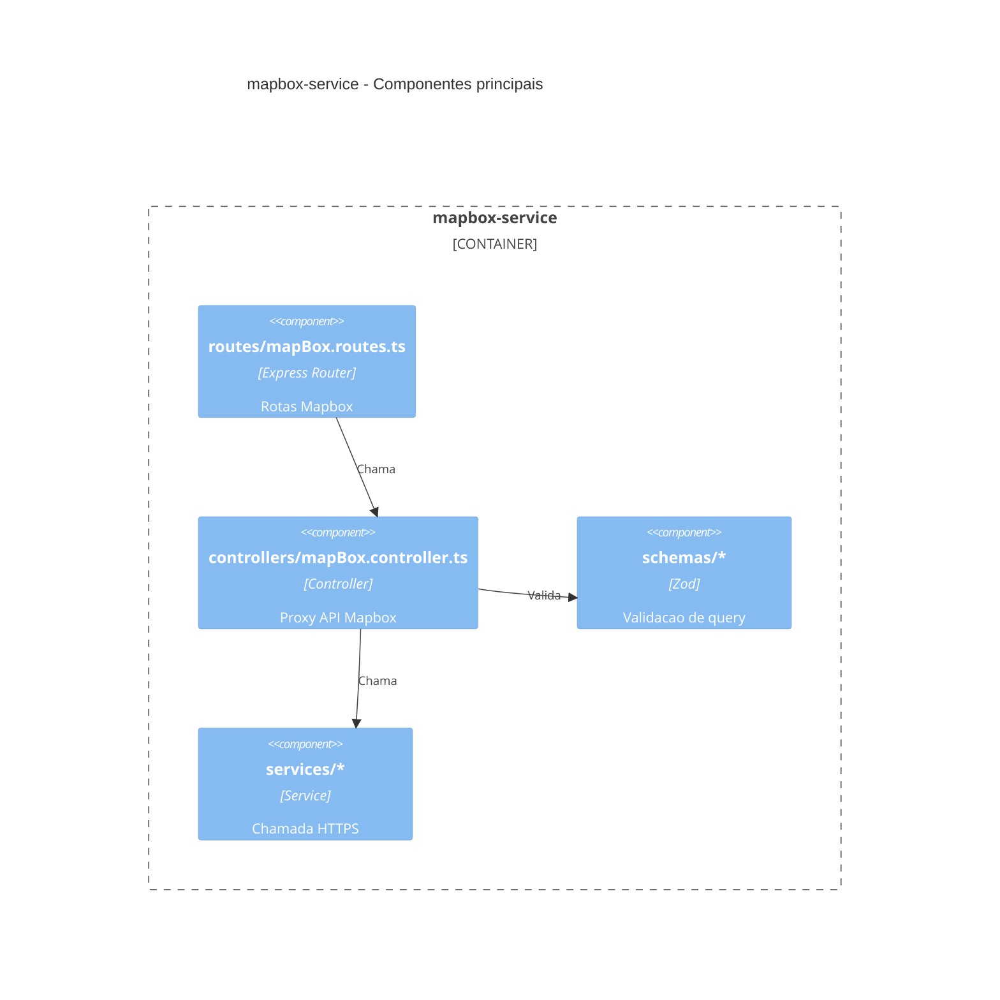

### Nivel 3 — Componentes (i18n-translation-service)

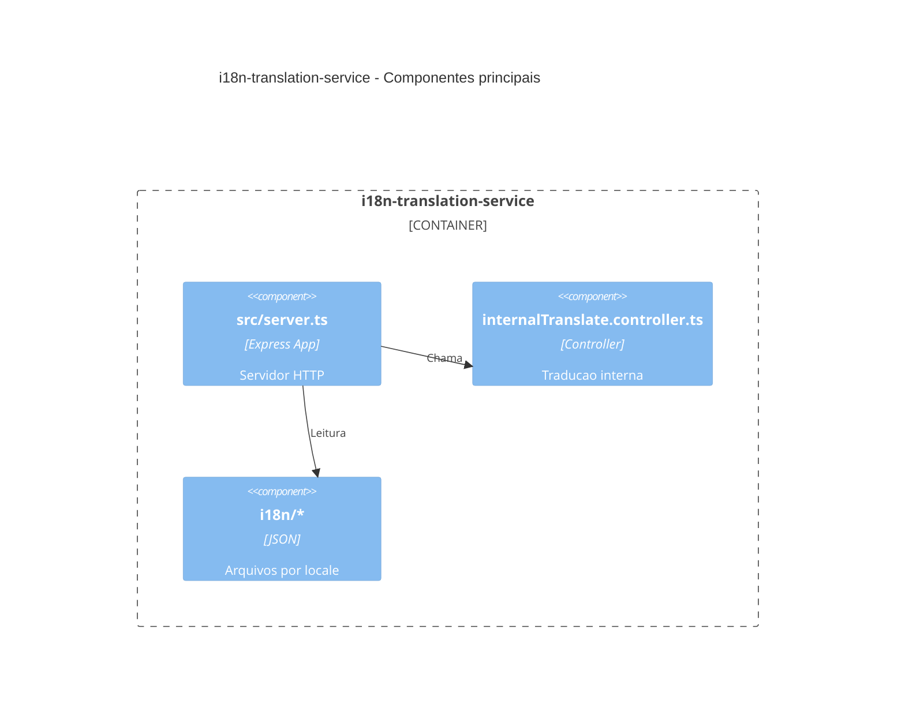

### Nivel 3 — Componentes (swagger-service)

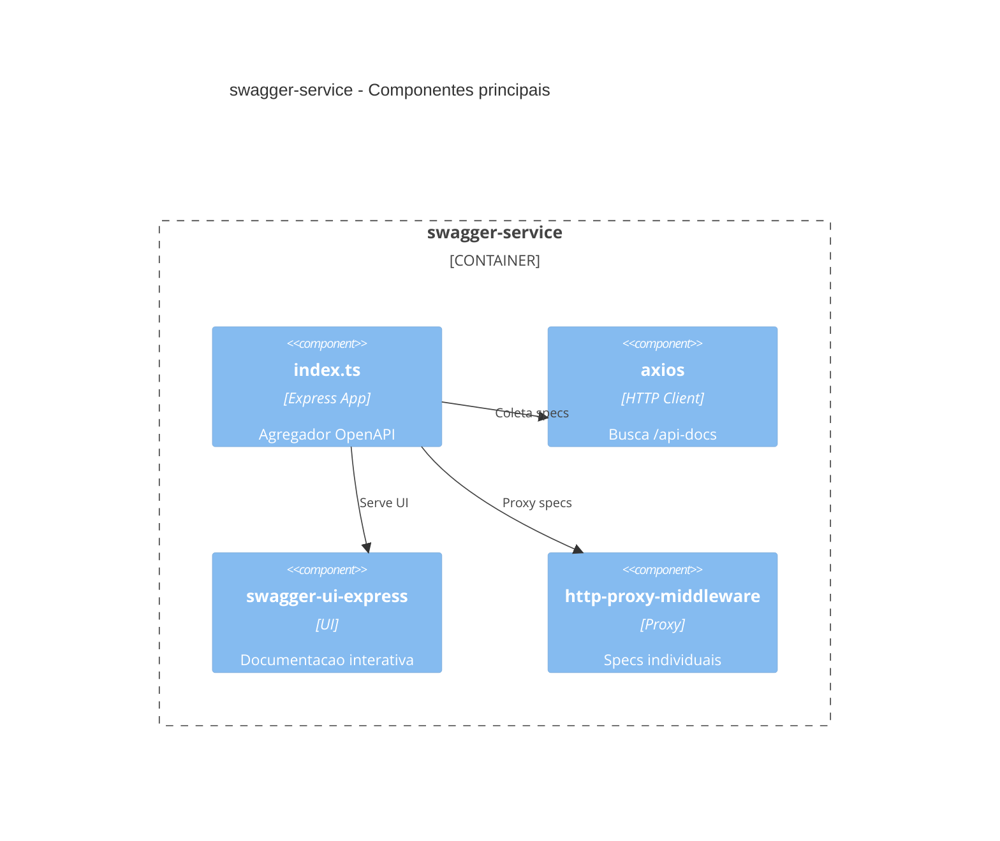

---

## 11. Recomendacoes Tecnicas

1. **Documentar modelos de dados por servico**
   - Motivo: facilita onboarding e alinhamento com frontends
   - Impacto esperado: menor retrabalho em integracoes

2. **Definir estrategia de testes por camada**
   - Motivo: cobertura ainda nao explicitada no repo
   - Impacto esperado: maior confiabilidade e regressao controlada

3. **Centralizar validacao de variaveis de ambiente**
   - Motivo: multiplos .env e dependencias cruzadas
   - Impacto esperado: erros de deploy detectados mais cedo

---

## 12. Conclusao Tecnica

O backend Total Fretes apresenta arquitetura consistente de microsservicos com gateway, isolamento por dominio e integracoes bem definidas (HTTP e AMQP). A base tecnica e moderna (Node.js 22, TypeScript 5.9, Express 5) e ja possui convencoes claras de validacao e documentacao OpenAPI. Os principais ganhos agora estao em consolidar a documentacao de dados e testes, e fortalecer a governanca de configuracoes e seguranca operacional.
