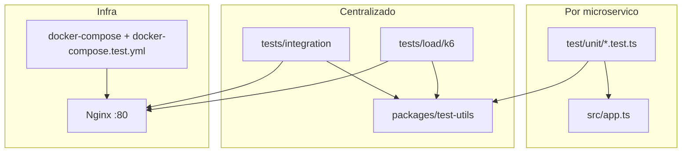
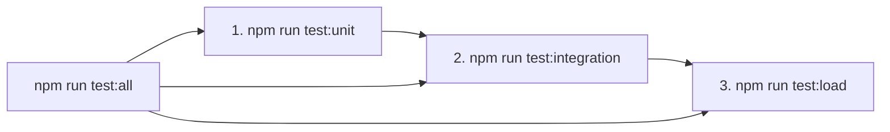

# Documentação da Suite de Testes — TotalFretes Backend

Este documento descreve como os testes estão organizados hoje, quais tecnologias são usadas e como executá-los localmente.

---

## Visão geral

O backend adota um modelo **híbrido** (recomendado para microserviços):

| Camada | Onde fica | Ferramenta | Precisa de Docker? |
|--------|-----------|------------|-------------------|
| **Unitários** | Dentro de cada microserviço (`<service>/test/unit/`) | Jest + Supertest | Não |
| **Integração de API** | `tests/integration/` | Jest + axios (via Nginx) | Sim |
| **Carga** | `tests/load/k6/` | K6 | Sim |
| **Utilitários** | `packages/test-utils/` | TypeScript | Não |

> **E2E com Cypress** (testes de interface no browser) ficam **fora do escopo atual** e serão implementados no futuro no frontend.



---

## Tecnologias

| Ferramenta | Versão (aprox.) | Uso |
|------------|-----------------|-----|
| [Jest](https://jestjs.io/) | 29.x | Runner de testes unitários e integração |
| [ts-jest](https://kulshekhar.github.io/ts-jest/) | 29.x | Compilação TypeScript nos testes |
| [Supertest](https://github.com/ladjs/supertest) | 7.x | Requisições HTTP contra `app.ts` (sem subir servidor) |
| [axios](https://axios-http.com/) | 1.x | Cliente HTTP nos testes de integração |
| [K6](https://k6.io/) | — (instalado no SO) | Testes de carga e performance |
| [@total-fretes/test-utils](packages/test-utils/) | interno | JWT, fixtures, mocks, helpers HTTP |

---

## Estrutura de pastas

```
TCC_ADS_backEnd-TotalFretes/
├── TESTING.md                          ← este arquivo
├── .env.test.example                   ← variáveis globais de teste
├── docker-compose.test.yml             ← override Docker para testes
├── package.json                        ← scripts npm na raiz
├── scripts/
│   ├── test-all.js                     ← suite completa em sequência
│   ├── test-unit-all.js                ← roda unitários dos 8 serviços
│   ├── test-service.js                 ← testes de um único serviço (demo)
│   ├── test-integration.js             ← sobe stack + integração
│   ├── test-load.js                    ← executa cenários K6
│   └── lib/test-summary.js             ← resumo formatado ao final
│
├── packages/test-utils/                ← biblioteca compartilhada
│   ├── src/jwt/                        ← createTestToken
│   ├── src/http/                       ← authenticatedRequest, attachTestPng
│   ├── src/fixtures/entities/          ← payloads CRUD válidos
│   ├── src/mocks/                      ← Express, Sequelize, axios
│   ├── src/jest/                       ← suites CRUD reutilizáveis
│   └── jest/base.config.js             ← config Jest base
│
├── tests/
│   ├── integration/                    ← testes de API via Nginx
│   │   ├── flows/                      ← 9 flows por domínio
│   │   ├── helpers/                    ← loginAsAdmin, etc.
│   │   └── setup/                      ← globalSetup, env
│   └── load/k6/
│       ├── scenarios/                  ← smoke, auth, freight
│       ├── lib/                        ← auth.js, http.js
│       └── config/thresholds.js
│
└── <microserviço>/
    ├── jest.config.js
    ├── tsconfig.jest.json
    ├── test/setup/env.ts               ← carrega .env.test + defaults
    ├── test/setup/mockModels.ts        ← mocks Sequelize/services (CRUD)
    └── test/unit/*.test.ts
```

## Inventário de testes (detalhado)

Referência completa do que cada camada valida hoje, com o nome de cada teste.

**Totais atuais:** 358 unitários · 17 integração · 4 cenários K6 (7 checks HTTP)

---

### Nível 1 — Testes unitários (por microserviço)

Testam o serviço **isolado** (`app.ts`, schemas Zod, middlewares, utils, **rotas CRUD HTTP**) — sem Docker.  
**358 testes** em **43 arquivos** (`<service>/test/unit/`).

#### Testes CRUD HTTP (`*.routes.test.ts`)

Matriz por operação (rotas protegidas): **401** sem token · **403** role inadequada · **400** validação · **404** não encontrado · **200/201** happy path (com mocks). Rotas públicas omitem 401/403.

| Serviço | Arquivo | Recurso | Testes |
|---------|---------|---------|--------|
| `authentication-service` | `account.routes.test.ts` | `/account` | 30 |
| `user-service` | `user.routes.test.ts` | `/user` | 18 |
| `user-service` | `cnh.routes.test.ts` | `/cnh` | 19 |
| `user-service` | `vehicle-type.routes.test.ts` | `/vehicle-type` | 17 |
| `user-service` | `group-vehicle-type.routes.test.ts` | `/group-vehicle-type` | 17 |
| `user-service` | `vehicle.routes.test.ts` | `/vehicle` | 15 |
| `company-service` | `company.routes.test.ts` | `/company` | 18 |
| `company-service` | `address.routes.test.ts` | `/address` | 19 |
| `freight-service` | `cargo-type.routes.test.ts` | `/cargo-type` | 17 |
| `freight-service` | `freight.routes.test.ts` | `/freight` | 16 |
| `freight-service` | `freight-status-type.routes.test.ts` | `/freight-status-type` | 18 |
| `freight-service` | `proposal.routes.test.ts` | `/proposal` | 16 |
| `freight-service` | `proposal-status-type.routes.test.ts` | `/proposal-status-type` | 18 |
| `storage-service` | `user-images.routes.test.ts` | `/user-images` | 14 |
| `storage-service` | `company-images.routes.test.ts` | `/company-images` | 15 |
| `storage-service` | `cargo-images.routes.test.ts` | `/cargo-images` | 14 |

**Subtotal CRUD:** 16 arquivos · **282 testes** (demais 76 testes = schemas, middlewares, health, utils).

#### `authentication-service` — 48 testes

| Arquivo | Grupo (`describe`) | Teste (`it`) |
|---------|---------------------|--------------|
| `health.app.test.ts` | `GET /` | retorna mensagem de serviço ativo |
| `health.app.test.ts` | `GET /api-docs` | retorna documentação OpenAPI |
| `login.schemas.test.ts` | `loginSchema` | aceita email e senha válidos |
| `login.schemas.test.ts` | `loginSchema` | rejeita email inválido |
| `login.schemas.test.ts` | `loginSchema` | rejeita senha vazia |
| `account.schemas.test.ts` | `accountSchema` | aceita payload válido de criação de conta |
| `account.schemas.test.ts` | `accountSchema` | rejeita senha com menos de 8 caracteres |
| `account.schemas.test.ts` | `accountSchema` | rejeita subject_id não positivo |
| `accountAdmin.schemas.test.ts` | `accountListQuerySchema` | aplica defaults de paginação |
| `accountAdmin.schemas.test.ts` | `accountListQuerySchema` | rejeita limit acima de 100 |
| `accountAdmin.schemas.test.ts` | `accountPatchSchema` | rejeita patch vazio |
| `accountAdmin.schemas.test.ts` | `accountPatchSchema` | aceita atualização de email |
| `accountAdmin.schemas.test.ts` | `accountAdminCreateSchema` | exige senha com mínimo de 8 caracteres |
| `accountAdmin.schemas.test.ts` | `subjectIdParamSchema` | aceita subjectId positivo via coerce |
| `accountAdmin.schemas.test.ts` | `subjectIdParamSchema` | rejeita subjectId zero ou negativo |
| `jwt.utils.test.ts` | `JWT utils` | gera e valida token de autenticação |
| `jwt.utils.test.ts` | `JWT utils` | gera e valida token de reset de senha |
| `jwt.utils.test.ts` | `JWT utils` | rejeita token de reset inválido |
| `account.routes.test.ts` | CRUD `/account` | 30 testes (401/403/400/404 + happy path) |

#### `user-service` — 98 testes

| Arquivo | Grupo | Teste |
|---------|-------|-------|
| `health.app.test.ts` | `GET /health` | retorna status 200 |
| `authMiddleware.middleware.test.ts` | `authMiddleware` | retorna 401 quando token não é enviado |
| `authMiddleware.middleware.test.ts` | `authMiddleware` | popula req.user com token válido |
| `authMiddleware.middleware.test.ts` | `authorizeRoles` | permite ADMIN independente do role exigido |
| `authMiddleware.middleware.test.ts` | `authorizeRoles` | nega role não autorizado |
| `user.schemas.test.ts` | `createUserSchema` | converte useGlasses e isDeficient de string para boolean |
| `user.schemas.test.ts` | `createUserSchema` | aceita boolean nativo |
| `user.schemas.test.ts` | `createUserSchema` | rejeita email inválido |
| `vehicle.schemas.test.ts` | `createVehicleSchema` | normaliza aliases plate e state para plateNumber e stateUF |
| `vehicle.schemas.test.ts` | `createVehicleSchema` | rejeita payload sem city |
| `user.routes.test.ts` | CRUD `/user` | 18 testes |
| `cnh.routes.test.ts` | CRUD `/cnh` | 19 testes |
| `vehicle-type.routes.test.ts` | CRUD `/vehicle-type` | 17 testes |
| `group-vehicle-type.routes.test.ts` | CRUD `/group-vehicle-type` | 17 testes |
| `vehicle.routes.test.ts` | CRUD `/vehicle` | 15 testes |

#### `company-service` — 50 testes

| Arquivo | Grupo | Teste |
|---------|-------|-------|
| `health.app.test.ts` | `GET /health` | retorna status 200 |
| `internalServiceMiddleware.middleware.test.ts` | `internalServiceMiddleware` | retorna 403 sem x-service-key |
| `internalServiceMiddleware.middleware.test.ts` | `internalServiceMiddleware` | permite requisição com chave válida |
| `authMiddleware.middleware.test.ts` | `company authMiddleware` | retorna 401 sem Authorization header |
| `authMiddleware.middleware.test.ts` | `company authMiddleware` | autentica token COMPANY |
| `authMiddleware.middleware.test.ts` | `company authorizeRoles` | permite ADMIN em rota COMPANY |
| `authMiddleware.middleware.test.ts` | `company authorizeRoles` | bloqueia USER em rota COMPANY |
| `cnpjInRfb2229.utils.test.ts` | `cnpjInRfb2229` | normalizeCnpj remove máscara e mantém 14 caracteres |
| `cnpjInRfb2229.utils.test.ts` | `cnpjInRfb2229` | isValidCnpjInRfb2229 aceita CNPJ seed válido |
| `cnpjInRfb2229.utils.test.ts` | `cnpjInRfb2229` | isValidCnpjInRfb2229 rejeita dígitos verificadores incorretos |
| `cnpjInRfb2229.utils.test.ts` | `cnpjInRfb2229` | isValidCnpjInRfb2229 rejeita tamanho inválido |
| `company.schemas.test.ts` | `createCompanySchema` | aceita payload válido e normaliza telefone e website |
| `company.schemas.test.ts` | `createCompanySchema` | rejeita CNPJ inválido |
| `company.schemas.test.ts` | `createCompanySchema` | rejeita email inválido |
| `company.routes.test.ts` | CRUD `/company` | 18 testes |
| `address.routes.test.ts` | CRUD `/address` | 19 testes |

#### `freight-service` — 104 testes

| Arquivo | Grupo | Teste |
|---------|-------|-------|
| `health.app.test.ts` | `GET /health` | retorna status 200 |
| `freight.schemas.test.ts` | `createFreightSchema` | aceita payload válido |
| `freight.schemas.test.ts` | `createFreightSchema` | rejeita latitude inválida |
| `freight.schemas.test.ts` | `createFreightSchema` | rejeita peso negativo ou zero |
| `authMiddleware.middleware.test.ts` | `freight authMiddleware` | retorna 401 sem Authorization header |
| `authMiddleware.middleware.test.ts` | `freight authMiddleware` | autentica token COMPANY |
| `authMiddleware.middleware.test.ts` | `freight authorizeRoles` | bloqueia USER em rota COMPANY |
| `proposals.schemas.test.ts` | `createProposalSchema` | aceita freight_id e value válidos |
| `proposals.schemas.test.ts` | `createProposalSchema` | rejeita value negativo |
| `proposals.schemas.test.ts` | `rejectProposalSchema` | aceita body undefined (PATCH sem corpo) |
| `proposals.schemas.test.ts` | `rejectProposalSchema` | rejeita comentário acima de 500 caracteres |
| `proposals.schemas.test.ts` | `proposalListQuerySchema` | aplica default enviada quando page informado sem status |
| `proposals.schemas.test.ts` | `proposalListQuerySchema` | normaliza status múltiplos separados por vírgula |
| `proposals.schemas.test.ts` | `proposalFreightSummaryQuerySchema` | aplica defaults page, limit e proposal_status |
| `common.schemas.test.ts` | `idParamSchema` | aceita id positivo via coerce |
| `common.schemas.test.ts` | `idParamSchema` | rejeita id zero |
| `common.schemas.test.ts` | `idParamSchema` | rejeita id negativo |
| `cargo-type.routes.test.ts` | CRUD `/cargo-type` | 17 testes |
| `freight.routes.test.ts` | CRUD `/freight` | 16 testes |
| `freight-status-type.routes.test.ts` | CRUD `/freight-status-type` | 18 testes |
| `proposal.routes.test.ts` | CRUD `/proposal` | 16 testes |
| `proposal-status-type.routes.test.ts` | CRUD `/proposal-status-type` | 18 testes |

#### `storage-service` — 43 testes

| Arquivo | Grupo | Teste |
|---------|-------|-------|
| `health.app.test.ts` | `GET /health` | retorna status 200 |
| `upload.utils.test.ts` | `upload utils` | getStoredRelativePath monta caminho relativo em uploads/user-images |
| `user-images.routes.test.ts` | CRUD `/user-images` | 14 testes |
| `company-images.routes.test.ts` | CRUD `/company-images` | 15 testes |
| `cargo-images.routes.test.ts` | CRUD `/cargo-images` | 14 testes |

#### `mapbox-service` — 7 testes

| Arquivo | Grupo | Teste |
|---------|-------|-------|
| `health.app.test.ts` | `GET /health` | retorna status OK |
| `mapBox.schemas.test.ts` | `mapBox schemas` | forwardQuerySchema exige consulta com tamanho mínimo |
| `mapBox.schemas.test.ts` | `mapBox schemas` | reverseQuerySchema valida coordenadas |
| `mapBox.schemas.test.ts` | `mapBox schemas` | routeQuerySchema exige moradaDestino e origem |
| `mapBox.schemas.test.ts` | `mapBox schemas` | normalizeRouteQuery converte arrays em string |
| `mapBox.schemas.test.ts` | `mapBox schemas` | routeQuerySchema rejeita sem moradaCarga nem coordenadasOrigem |
| `mapBox.schemas.test.ts` | `mapBox schemas` | routeQuerySchema rejeita coordenadasMotorista e coordenadasOrigem juntos |

#### `email-management-service` — 7 testes

| Arquivo | Grupo | Teste |
|---------|-------|-------|
| `health.app.test.ts` | `GET /health` | retorna OK |
| `passwordResetEmail.schemas.test.ts` | `passwordResetEmailMessageSchema` | aceita job válido de reset de senha |
| `passwordResetEmail.schemas.test.ts` | `passwordResetEmailMessageSchema` | rejeita type incorreto |
| `passwordResetEmail.schemas.test.ts` | `passwordResetEmailMessageSchema` | rejeita email inválido |
| `emailAmqp.utils.test.ts` | `emailAmqpConfig` | retorna defaults de exchange, queue e routing key |
| `emailAmqp.utils.test.ts` | `buildEmailAmqpUri` | adiciona heartbeat quando ausente na URL |
| `emailAmqp.utils.test.ts` | `buildEmailAmqpUri` | lança erro quando RABBITMQ_URL não está definida |

#### `swagger-service` — 1 teste

| Arquivo | Grupo | Teste |
|---------|-------|-------|
| `health.app.test.ts` | `GET /health` | retorna ok |

---

### Nível 2 — Testes de integração (API via Nginx)

Testam o sistema **em conjunto** — Docker + gateway na porta 80.  
**17 testes** em `tests/integration/flows/`.

#### `00-health-all-services.test.ts` — 3 testes

**Serviços:** authentication, email-management, storage

| Grupo | Teste |
|-------|-------|
| `API Flow: health via Nginx` | authentication-service responde via gateway em `/api/auth/health` |
| `API Flow: health via Nginx` | email-management-service responde via gateway em `/api/email/health` |
| `API Flow: health via Nginx` | storage-service responde via gateway em `/storage` |

#### `01-auth-account.test.ts` — 3 testes

**Serviço principal:** `authentication-service`

| Grupo | Teste |
|-------|-------|
| `API Flow: autenticação e conta` | login com credenciais de admin seed retorna token |
| `API Flow: autenticação e conta` | rota protegida verify-token aceita token válido |
| `API Flow: autenticação e conta` | login com senha inválida retorna erro |

#### `02-user-vehicle.test.ts` — 2 testes

**Serviço principal:** `user-service`

| Grupo | Teste |
|-------|-------|
| `API Flow: usuário e veículos` | lista tipos de veículo com token admin |
| `API Flow: usuário e veículos` | lista grupos de tipo de veículo |

#### `03-company-address.test.ts` — 1 teste

**Serviço principal:** `company-service`

| Grupo | Teste |
|-------|-------|
| `API Flow: empresa e endereço` | lista empresas com autenticação admin |

#### `04-freight-proposal.test.ts` — 3 testes

**Serviço principal:** `freight-service`

| Grupo | Teste |
|-------|-------|
| `API Flow: fretes e propostas` | lista fretes autenticado |
| `API Flow: fretes e propostas` | lista tipos de carga |
| `API Flow: fretes e propostas` | lista status de frete |

#### `05-storage-upload.test.ts` — 1 teste

**Serviço principal:** `storage-service`

| Grupo | Teste |
|-------|-------|
| `API Flow: storage` | storage responde via gateway (/storage evita //health no proxy Nginx) |

#### `06-mapbox-proxy.test.ts` — 1 teste

**Serviço principal:** `mapbox-service`

| Grupo | Teste |
|-------|-------|
| `API Flow: mapbox proxy` | rota de geocode-forward responde via gateway |

#### `07-email-queue.test.ts` — 1 teste

**Serviço principal:** `email-management-service`

| Grupo | Teste |
|-------|-------|
| `API Flow: email management` | health do serviço de email via gateway |

#### `08-swagger-aggregation.test.ts` — 2 testes

**Serviço principal:** `swagger-service`

| Grupo | Teste |
|-------|-------|
| `API Flow: swagger aggregation` | health do swagger-service responde via gateway |
| `API Flow: swagger aggregation` | endpoint /docs retorna JSON OpenAPI via gateway |

---

### Nível 3 — Testes de carga (K6)

Validam **checks** HTTP sob carga (não usam `it()` do Jest).  
**4 cenários** em `tests/load/k6/scenarios/`.

#### `smoke.js` (~30s, 2 VUs)

| Check | Endpoint |
|-------|----------|
| `/api/auth/health status 200` | `GET /api/auth/health` |
| `/api/email/health status 200` | `GET /api/email/health` |
| `/storage status 200` | `GET /storage` |

**Thresholds:** taxa de falha &lt; 5%, p95 &lt; 800ms

#### `auth-login.js` (~2min, até 30 VUs)

| Check | Endpoint |
|-------|----------|
| `login status 200` | `POST /api/auth/login` |
| `login possui token` | corpo da resposta contém `token` |

**Thresholds:** falha &lt; 2%, p95 login &lt; 800ms

#### `freight-read.js` (~3min, até 60 VUs)

| Etapa | O que faz |
|-------|-----------|
| `setup` | login admin (obtém token) |
| `freight list status 200` | `GET /api/freight` autenticado |

**Thresholds:** falha &lt; 2%, p95 listagem &lt; 1000ms

#### `freight-write.js` (~2min, até 15 VUs)

| Etapa | O que faz |
|-------|-----------|
| `setup` | login admin (obtém token) |
| `cargo types status 200` | `GET /api/cargo-type` autenticado |

**Thresholds:** falha &lt; 5%, p95 &lt; 2000ms

---

### Visão resumida por serviço

| Serviço | Unitários | Integração | K6 |
|---------|-----------|------------|-----|
| **authentication-service** | health, login, account RPC, account admin, JWT (18) | login, verify-token, health gateway (4) | smoke + auth-login |
| **user-service** | health, authMiddleware, user/vehicle schemas (10) | tipos/grupos de veículo (2) | — |
| **company-service** | health, internal/auth middleware, CNPJ, company schema (14) | listagem de empresas (1) | — |
| **freight-service** | health, freight/proposal schemas, authMiddleware, idParam (17) | fretes, cargo-type, status (3) | freight-read, freight-write |
| **storage-service** | health, upload utils (2) | resposta via gateway (2) | smoke |
| **mapbox-service** | health, schemas Mapbox + superRefine (7) | geocode-forward via gateway (1) | — |
| **email-management-service** | health, schema AMQP, config RabbitMQ (7) | health via gateway (2) | smoke |
| **swagger-service** | health (1) | health + /docs OpenAPI (2) | — |

---

### O que ainda não é testado

- Upload real de imagens (storage) — só path utils hoje
- Criação/edição de frete ou proposta via API (schemas unitários existem; integração só lista)
- Rotas de endereço (`/api/address`) além de listagem indireta
- Controllers, services e consumer AMQP ponta a ponta
- Agregação Swagger (`GET /docs`) em unitário
- Validação de logo PNG da empresa
- E2E de interface (Cypress — fora do escopo atual)

---

## Pré-requisitos

### Para testes unitários
- **Node.js** 22+ (mesma versão dos Dockerfiles)
- `npm install` em cada microserviço (ou ao menos nos que for testar)
- Build do pacote compartilhado:

```powershell
cd packages/logging
npm install
npm run build

cd ../tracing
npm install
npm run build

cd ../test-utils
npm install
npm run build
```

### Para testes de integração
- **Docker Desktop** rodando
- Stack configurada com `.env` de cada serviço (como no desenvolvimento normal)
- Copiar variáveis globais de teste:

```powershell
copy .env.test.example .env.test
```

### Para testes de carga
- Tudo acima **+** [K6 instalado](https://grafana.com/docs/k6/latest/set-up/install-k6/)

```powershell
choco install k6
# ou baixar binário em https://github.com/grafana/k6/releases
```

---

## Lista completa de comandos

Todos os comandos `npm run` da tabela abaixo são executados na **raiz do backend** (`TCC_ADS_backEnd-TotalFretes/`), salvo indicação contrária.

Ao final de `test:all`, `test:unit`, `test:integration`, `test:load` e `test:service`, um **resumo formatado** é exibido no terminal.

### Comandos na raiz (`package.json`)

| Comando | O que faz | Docker? | Tempo aprox. |
|---------|-----------|---------|--------------|
| `npm test` | Alias de `test:unit` | Não | ~4 min |
| `npm run test:unit` | Unitários dos 8 microserviços (76 testes) | Não | ~4 min |
| `npm run test:service -- <serviço>` | Unitários de **um** serviço (ideal para demo) | Não* | ~10–50s |
| `npm run test:service -- <serviço> --with-integration` | Unitários + flows de integração do serviço | Sim* | ~1–3 min |
| `npm run test:service -- --list` | Lista serviços, aliases e exemplos | Não | instantâneo |
| `npm run test:integration` | Sobe stack + integração (9 flows) | Sim (up) | ~4–5 min |
| `npm run test:integration:local` | Integração sem subir Docker | Sim (já up) | ~10s |
| `npm run test:integration:up` | Apenas sobe o stack de teste | Sim (up) | ~1–2 min |
| `npm run test:integration:down` | Derruba o stack de teste | Sim (down) | ~30s |
| `npm run test:load:smoke` | K6 smoke (health checks) | Sim (já up) | ~30s |
| `npm run test:load` | K6 — todos os cenários | Sim (já up) | ~8 min |
| `npm run test:all` | Unitários → integração → carga K6 | Sim (up) | ~8 min |
| `npm run test:all:local` | Igual `test:all`, sem `docker up` na integração | Sim (já up) | ~6 min |
| `npm run test:all:ci` | Igual `test:all` + derruba stack ao final | Sim (up+down) | ~8 min |

\* Com `--with-integration`, use `--skip-stack` se o Docker já estiver rodando.

### Aliases do `test:service`

| Alias | Serviço | Flows de integração (com `--with-integration`) |
|-------|---------|--------------------------------------------------|
| `auth` | authentication-service | health + login/verify-token |
| `user` | user-service | health + tipos de veículo |
| `company` | company-service | health + listagem de empresas |
| `freight` | freight-service | health + fretes e propostas |
| `storage` | storage-service | health + storage via gateway |
| `mapbox` | mapbox-service | proxy geocode |
| `email` | email-management-service | health + fila de e-mail |
| `swagger` / `docs` | swagger-service | agregação OpenAPI |

**Exemplos:**

```powershell
npm run test:service -- mapbox
npm run test:service -- auth
npm run test:service -- freight --with-integration
npm run test:service -- mapbox --with-integration --skip-stack
npm run test:service -- --list
```

### Scripts diretos (`node scripts/...`)

Úteis quando precisa de flags extras não expostas no `package.json`.

| Comando | Descrição |
|---------|-----------|
| `node scripts/test-all.js` | Suite completa |
| `node scripts/test-all.js --skip-stack` | Suite sem `docker compose up` na integração |
| `node scripts/test-all.js --skip-load` | Suite sem fase K6 |
| `node scripts/test-all.js --teardown` | Suite + derruba stack ao final |
| `node scripts/test-all.js --skip-stack --skip-load` | Só unitários + integração (stack já up) |
| `node scripts/test-unit-all.js` | Unitários dos 8 serviços |
| `node scripts/test-integration.js` | Sobe stack + integração |
| `node scripts/test-integration.js --skip-stack` | Integração sem subir Docker |
| `node scripts/test-service.js <serviço>` | Testes de um serviço |
| `node scripts/test-service.js <serviço> --with-integration` | Serviço + integração |
| `node scripts/test-service.js --list` | Ajuda e lista de serviços |
| `node scripts/test-load.js smoke` | K6 smoke |
| `node scripts/test-load.js auth` | K6 login |
| `node scripts/test-load.js freight-read` | K6 leitura de fretes |
| `node scripts/test-load.js freight-write` | K6 tipos de carga |
| `node scripts/test-load.js all` | K6 — todos os cenários |

### Por microserviço (`cd <serviço>/`)

Válido para os 8 serviços com pasta `test/unit/`.

| Comando | Descrição |
|---------|-----------|
| `npm test` | Todos os testes Jest do serviço |
| `npm run test:unit` | Apenas `test/unit/` |
| `npm run test:watch` | Modo watch (re-executa ao salvar) |

```powershell
cd authentication-service
npm test

cd mapbox-service
npm run test:unit
npm run test:watch
```

### Projeto de integração (`cd tests/integration/`)

| Comando | Descrição |
|---------|-----------|
| `npm test` | Todos os 9 flows (requer stack + `globalSetup`) |
| `npm run test:watch` | Modo watch |

```powershell
# Pré-requisito: stack rodando
npm run test:integration:up

cd tests/integration
npm test
```

**Flow específico (Jest direto):**

```powershell
cd tests/integration
npx jest --runInBand flows/01-auth-account.test.ts
npx jest --runInBand flows/06-mapbox-proxy.test.ts
```

### K6 direto (sem script npm)

Pré-requisito: `npm run test:integration:up`

```powershell
k6 run tests/load/k6/scenarios/smoke.js
k6 run tests/load/k6/scenarios/auth-login.js
k6 run tests/load/k6/scenarios/freight-read.js
k6 run tests/load/k6/scenarios/freight-write.js
```

### Preparação dos pacotes compartilhados (antes dos testes)

```powershell
cd packages/logging
npm install && npm run build

cd ../tracing
npm install && npm run build

cd ../test-utils
npm install && npm run build
```

### Matriz: suite completa (`test:all`)

| Comando | Unitários | Integração | Carga | Docker up | Docker down | Resumo |
|---------|-----------|------------|-------|-------------|-------------|--------|
| `test:all` | Sim | Sim | Sim | Sim | Não | Sim |
| `test:all:local` | Sim | Sim | Sim | Não | Não | Sim |
| `test:all:ci` | Sim | Sim | Sim | Sim | Sim | Sim |

> A suite completa (`test:all`) leva cerca de **8 minutos** (~500s) com a configuração atual. Para apresentações, prefira `npm run test:service -- <serviço>` (~10–50s).

### Fluxo recomendado por objetivo

| Objetivo | Comando |
|----------|---------|
| Desenvolvimento diário | `npm run test:unit` |
| Validar um serviço antes do commit | `npm run test:service -- <serviço>` |
| Apresentação / demo rápida | `npm run test:service -- mapbox` |
| Demo com API real (stack já up) | `npm run test:service -- freight --with-integration --skip-stack` |
| Validar contratos entre serviços | `npm run test:integration` |
| Validar performance | `npm run test:integration:up` → `npm run test:load` → Grafana Tempo |
| CI local / pré-merge completo | `npm run test:all:ci` |

---

## Variáveis de ambiente

### Globais (`.env.test` na raiz)

| Variável | Valor padrão | Uso |
|----------|--------------|-----|
| `API_BASE_URL` | `http://localhost:80` | Gateway Nginx nos testes de integração/carga |
| `JWT_SECRET` | `test-jwt-secret-totalfretes-suite` | Deve ser igual em todos os serviços no modo teste |
| `ADMIN_SEED_EMAIL` | `admin@totalfretes.com.br` | Login nos flows de integração |
| `ADMIN_SEED_PASSWORD` | `Admin@123456` | Login nos flows de integração |

### Por serviço (`<service>/test/setup/env.ts`)

Cada microserviço carrega automaticamente, nesta ordem:
1. `../../.env.test` (raiz)
2. `<service>/.env.test` (se existir)
3. Defaults embutidos (`JWT_SECRET`, `DB_*`, etc.)

Isso permite rodar unitários **sem Docker** e sem banco real.

### K6 (opcional)

| Variável | Default |
|----------|---------|
| `API_BASE_URL` | `http://localhost:80` |
| `ADMIN_EMAIL` | `admin@totalfretes.com.br` |
| `ADMIN_PASSWORD` | `Admin@123456` |

---

## Convenções adotadas

### Nomenclatura de arquivos
- `health.app.test.ts` — health check HTTP do `app.ts`
- `*.routes.test.ts` — CRUD HTTP via Supertest + mocks (Sequelize/axios/services)
- `*.schemas.test.ts` — validação Zod
- `*.middleware.test.ts` — middlewares isolados

### Como mockar em `*.routes.test.ts`

1. **`test/setup/mockModels.ts`** (por serviço) — registra `jest.mock` de `database`, models e services **antes** do import de `app` (via `setupFiles` no `jest.config.js`).
2. **Helpers** em `packages/test-utils`:
   - `authenticatedRequest` / `asAdmin` / `asCompany` / `asUser` — header `Authorization`
   - `createModelMock` / `createMockModelInstance` — Sequelize
   - `defineProtectedJsonCrudTests` / `definePublicStoredImageCrudTests` — matriz CRUD reutilizável
   - `attachTestPng` — upload multipart em storage
3. **Padrão mínimo:**

```typescript
import { cargoTypeModel } from '../setup/mockModels';
import app from '../../src/app';

describe('cargo-type CRUD routes', () => {
  defineProtectedJsonCrudTests({
    app,
    basePath: '/cargo-type',
    model: cargoTypeModel,
    validCreate: { name: 'Grãos' },
    invalidCreate: { name: '' },
    roles: { create: ['COMPANY'], forbidden: 'USER' },
  });
});
```

### Padrão dos testes
- **AAA**: Arrange → Act → Assert
- Um comportamento por `it(...)`
- Integração: `describe('API Flow: ...')` (não usar "E2E" — reservado para Cypress)

### Configuração Jest
- Base compartilhada: `packages/test-utils/jest/base.config.js`
- `forceExit: true` — evita travamento por handles do Winston/Loki
- `setupFiles`: `test/setup/env.ts` + `test/setup/mockModels.ts` (serviços com CRUD) — env e mocks antes dos imports

---

## Infraestrutura Docker de teste

O arquivo `docker-compose.test.yml` aplica overrides sem alterar o compose principal:

- `JWT_SECRET` e `INTERNAL_SERVICE_KEY` fixos para todos os serviços stateful
- `ADMIN_SEED_ENABLED=true` no authentication-service
- `SEED_TEST_DATA=true` no freight-service (dados `TF-TEST-*`)
- Nginx com `nginx.test.conf` (rate limits relaxados para integração e K6)

---

## Ordem recomendada de execução



1. **Unitários** — feedback rápido, sem infra
2. **Integração** — valida contratos entre microserviços
3. **Carga** — valida latência e throughput sob stress

Ou use **`npm run test:all`** para executar as três fases automaticamente em sequência.

---

## Observabilidade durante testes de carga

Com a stack de teste ativa (`npm run test:integration:up`), o **Grafana Tempo** recebe traces do K6 e dos microserviços instrumentados no caminho da carga.

| Serviço | Porta | Função |
|---------|-------|--------|
| Grafana | `3101` | UI (`admin` / `admin`) |
| Loki | `3100` | Logs (Promtail → containers) |
| Tempo | `3200` (query), `4317` (OTLP gRPC) | Traces distribuídos |

### Fluxo recomendado

1. `npm run test:integration:up`
2. `npm run test:load:smoke` (export OTLP automático se Tempo estiver up)
3. Abrir [http://localhost:3101](http://localhost:3101) → dashboard **K6 Load Test Traces** ou **Explore → Tempo**
4. Filtrar `{resource.service.name="k6-load-test"}` ou `{resource.service.name="freight-service"}`
5. Em um trace, usar **Logs for this span** para ver access logs correlacionados no Loki (`trace_id`)

Para desabilitar export OTLP do K6: `node scripts/test-load.js smoke --without-traces` ou `K6_WITH_TRACES=false`.

---

## Solução de problemas

| Problema | Causa provável | Solução |
|----------|----------------|---------|
| Jest não encerra / trava | Handles abertos do logger (Loki) | Já mitigado com `forceExit: true` na config base |
| `JWT_SECRET não foi configurado` | Env não carregado antes do import | Verificar `test/setup/env.ts` e `jest.config.js` |
| Integração: timeout no globalSetup | Stack Docker lento ou não subiu | `npm run test:integration:up` manualmente e aguardar |
| `container X is unhealthy` no `docker compose --wait` | Healthcheck com `wget` em imagem sem wget | Healthchecks dos serviços Node usam `node -e require('http')...` |
| Timeout em `nginx-storage-health` | `/storage/health` vira `//health` no proxy Nginx | Use `/storage` nos testes de integração e K6 smoke |
| `company-service is unhealthy` no `--wait` | Seed depende do `authentication-service` | `docker-compose.test.yml` ordena `depends_on` e aumenta `start_period` |
| Integração: 401 em rotas protegidas | `JWT_SECRET` divergente entre serviços | Usar `docker-compose.test.yml` |
| Integração: 429 Too Many Requests | Rate limit do Nginx | Confirmar que `nginx.test.conf` está montado |
| K6: comando não encontrado | K6 não instalado no SO | `choco install k6` |
| `npm install` falha em serviço | `packages/logging` ou `packages/tracing` não compilados | Build pacotes compartilhados antes (ver Pré-requisitos) |
| Login integração falha | Admin seed não criado | Verificar `ADMIN_SEED_*` no `.env` do authentication-service |

---

## Próximos passos (não implementados)

- **Cypress** — E2E de UI no frontend, reutilizando `docker-compose.test.yml`
- **CI/CD** — jobs separados: unitários em PR, integração em merge, carga em nightly
- **Cobertura** — `jest --coverage` por serviço com meta mínima
- **Mais unitários** — consumer AMQP, agregação Swagger (`GET /docs`), logo PNG, workflows de proposta/frete (PATCH accept/cancel)

---

## Referências rápidas

| Documento | Conteúdo |
|-----------|----------|
| [tests/README.md](tests/README.md) | Resumo e links |
| [tests/load/README.md](tests/load/README.md) | Detalhes dos cenários K6 |
| [.env.test.example](.env.test.example) | Template de variáveis globais |
| [packages/test-utils/](packages/test-utils/) | Código dos utilitários compartilhados |
