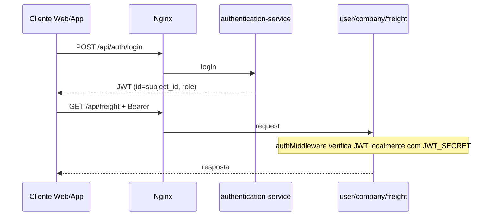
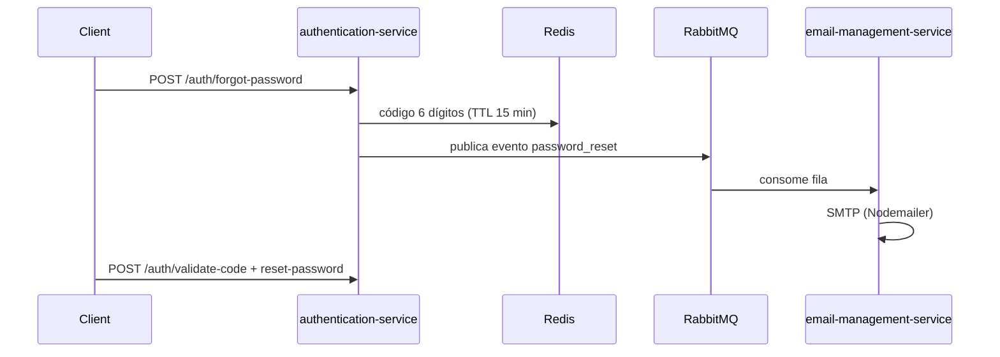

# Total Fretes — Backend (monorepo)

## Resumo

Monorepo de microsserviços Node.js do ecossistema **Total Fretes** (TCC). Expõe uma API REST unificada via **Nginx** na porta 80 (`/api/*`), com bancos MySQL isolados por domínio, **Redis** para cache de reset de senha e **RabbitMQ** para envio assíncrono de e-mails. Atende o portal web de empresas e o app mobile de motoristas.

## Responsabilidades

- Autenticação centralizada (JWT, contas, recuperação de senha)
- Domínio de caminhoneiro (usuário, CNH, veículos)
- Domínio de empresa (cadastro, endereços, imagem)
- Fretes e propostas
- Upload e metadados de arquivos
- Proxy Mapbox, traduções i18n e documentação OpenAPI agregada

## Stack e dependências

| Camada | Tecnologia |
|--------|------------|
| Runtime | Node.js 22 (`node:22-slim` nos Dockerfiles) |
| API | Express 5 (swagger-service: Express 4) |
| Linguagem | TypeScript 5.9 |
| ORM | Sequelize 6 + mysql2 |
| Validação | Zod 4 |
| Auth | jsonwebtoken, bcrypt |
| HTTP entre serviços | axios |
| Cache | ioredis (authentication-service) |
| Mensageria | amqplib + RabbitMQ |
| Gateway | Nginx |
| Contratos compartilhados | `@total-fretes/rpc-contracts` (Zod; filas AMQP, não gRPC) |

**Não há** npm workspaces na raiz: cada serviço tem `package.json` próprio. Dependência local ao pacote de contratos via `file:../packages/rpc-contracts`.

## Estrutura de pastas

```text
TCC_ADS_backEnd-TotalFretes/
├── docker-compose.yml
├── nginx/                    # API Gateway
├── packages/rpc-contracts/   # Contratos AMQP (Zod)
├── docs/
│   ├── PROJECT.md            # Este arquivo
│   └── services/*.md         # Um MD por microsserviço
├── authentication-service/
├── user-service/
├── company-service/
├── freight-service/
├── storage-service/
├── email-management-service/
├── mapbox-service/
├── i18n-translation-service/
└── swagger-service/
```

Padrão típico de um serviço com banco: `src/{index,app,routes,controllers,models,schemas,middleware,config,services,utils}`, mais `api-docs.ts` (OpenAPI).

## Microsserviços (índice)

| Serviço | Porta | MySQL (host) | Documentação |
|---------|-------|--------------|--------------|
| authentication-service | 3000 | 3306 | [authentication-service.md](services/authentication-service.md) |
| user-service | 3001 | 3307 | [user-service.md](services/user-service.md) |
| company-service | 3002 | 3308 | [company-service.md](services/company-service.md) |
| email-management-service | 3003 | — | [email-management-service.md](services/email-management-service.md) |
| mapbox-service | 3004 | — | [mapbox-service.md](services/mapbox-service.md) |
| swagger-service | 3005 | — | [swagger-service.md](services/swagger-service.md) |
| i18n-translation-service | 3006 | — | [i18n-translation-service.md](services/i18n-translation-service.md) |
| storage-service | 3007 | 3309 | [storage-service.md](services/storage-service.md) |
| freight-service | 3008 | 3310 | [freight-service.md](services/freight-service.md) |
| **nginx** | **80** | — | `nginx/conf.d/app.conf` |

## Mapa de roteamento Nginx (gateway)

Entrada pública: `http://localhost` (porta 80). Prefixo comum: `/api`.

| Prefixo público | Serviço backend |
|-----------------|-----------------|
| `/api/auth`, `/api/account` | authentication-service |
| `/api/user`, `/api/cnh`, `/api/group-vehicle-type`, `/api/vehicle-type`, `/api/vehicle` | user-service |
| `/api/company`, `/api/address` | company-service |
| `/api/email/` | email-management (apenas health exposto) |
| `/api/mapbox/` | mapbox-service |
| `/api/i18n-translation/` | i18n (arquivos estáticos JSON) |
| `/api/freight`, `/api/freight/`, `/api/cargo-type`, `/api/freight-status-type`, `/api/proposal`, `/api/proposal-status-type` | freight-service |
| `/api/user-images/`, `/api/uploads/` | storage-service |
| `/api-docs/`, `/swagger-ui`, `/docs` | swagger-service |

## Autenticação entre clientes e microsserviços



- **Emissão:** `authentication-service` (`POST /auth/login`).
- **Validação em domínio:** middlewares com `JWT_SECRET` compartilhado (`verifyToken`). Contrato HTTP `POST /auth/validate` existe para integração explícita; ver [authentication-service.md](services/authentication-service.md).
- **Roles no token:** `USER` (motorista), `COMPANY` (empresa), `ADMIN`.

## Fluxo: recuperação de senha



## Pacote `@total-fretes/rpc-contracts`

Local: `packages/rpc-contracts/`. Build: `npm run build` → `dist/`.

| Módulo | Uso |
|--------|-----|
| `envelope.ts` | `RpcEnvelope` (pending/success/error) para request-reply em filas |
| `account.ts` | Schema de criação de conta |
| `email-events.ts` | `passwordResetEmailMessageSchema` |
| `email-topology.ts` | Defaults de exchange/filas/DLX |
| `queues.ts` | `DEFAULT_ACCOUNT_CREATE_RPC_QUEUE` |
| `validation.ts` | `parseRpcPayload()` com Zod |

Consumidores diretos: `authentication-service`, `email-management-service`.

## Integrações (visão geral)

| De | Para | Motivo |
|----|------|--------|
| authentication-service | RabbitMQ, Redis | Reset de senha |
| user-service | authentication-service, storage-service | Conta, imagens |
| company-service | authentication-service, storage-service | Conta, imagens |
| freight-service | i18n-translation-service | Mensagens traduzidas |
| swagger-service | auth, user, company, storage, freight | Agregar OpenAPI |
| Clientes | Nginx :80 | API única |

## Variáveis de ambiente (raiz)

| VAR | Obrigatória | Descrição |
|-----|-------------|-----------|
| `RABBITMQ_DEFAULT_USER` | Sim (Docker) | Usuário RabbitMQ |
| `RABBITMQ_DEFAULT_PASS` | Sim (Docker) | Senha RabbitMQ |

Cada serviço possui `.env` e `.env.example` na própria pasta (`PORT`, `JWT_SECRET`, `DB_*`, URLs inter-serviço).

## Como executar

### Stack completa (Docker)

Na raiz do repositório, com `.env` preenchidos em cada serviço:

```bash
docker compose up --build
```

- API: http://localhost (Nginx)
- RabbitMQ Management: http://localhost:15672
- MySQL: portas 3306–3310 no host
- i18n direto (dev): http://localhost:3006

### Serviço isolado (desenvolvimento)

```bash
cd authentication-service   # ou outro serviço
npm install
npm run dev
```

Contratos compartilhados (quando alterados):

```bash
cd packages/rpc-contracts
npm install && npm run build
```

## Convenções do código

- Validar entrada com **Zod** em `schemas/`; controllers finos.
- Rotas protegidas: `authMiddleware` + `authorizeRoles` / `allowOwnerOrRoles`.
- OpenAPI em `api-docs.ts` por serviço; manter alinhado às rotas reais.
- Mensagens de erro: preferir chaves i18n quando o serviço integra `I18N_SERVICE_URL`.
- Não commitar `.env`; usar `.env.example` como modelo.
- Commits: Husky + commitlint na raiz do monorepo.

## Relacionados

| Repositório | Caminho (workspace TCC) | Público |
|-------------|-------------------------|---------|
| Portal empresa | `../TCC_ADS_TotalFretesEmpresa/docs/PROJECT.md` | `COMPANY`, `ADMIN` |
| App motorista | `../TCC_ADS_appTotalFretes/docs/PROJECT.md` | `USER`, `ADMIN` |

## Referências no repositório

- [docker-compose.yml](../docker-compose.yml)
- [nginx/conf.d/app.conf](../nginx/conf.d/app.conf)
- [packages/rpc-contracts](../packages/rpc-contracts)
- [authentication-service/README.md](../authentication-service/README.md) (legado; preferir `docs/services/authentication-service.md`)
